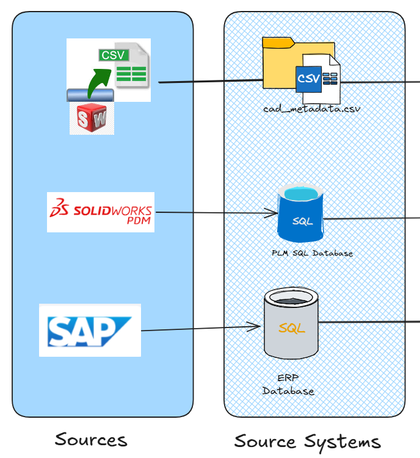
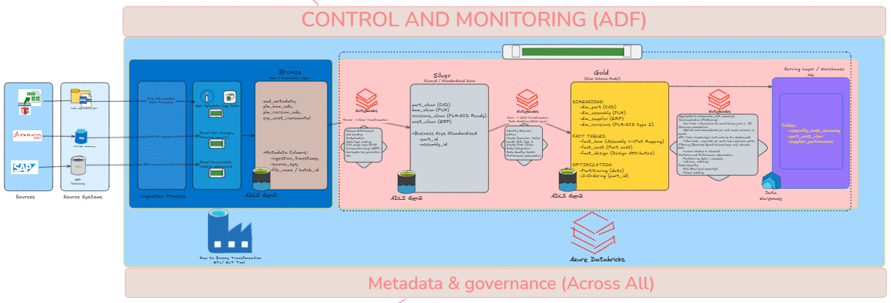
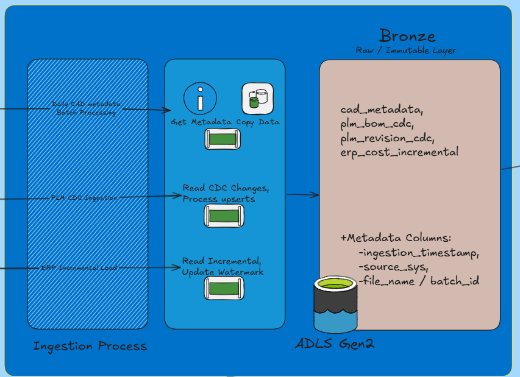
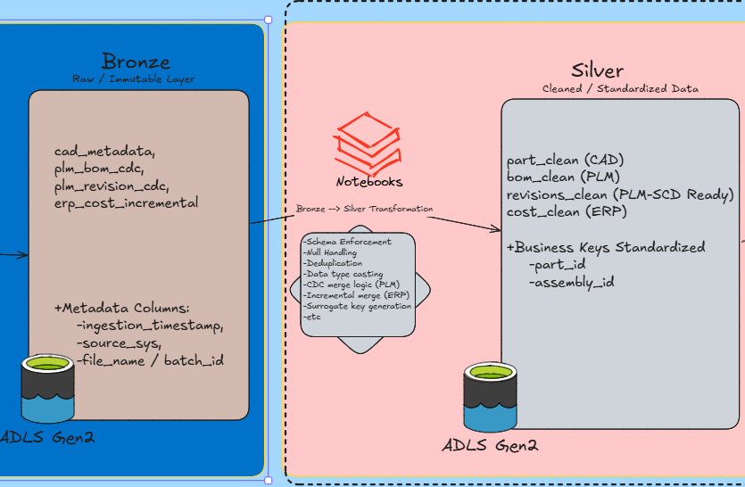
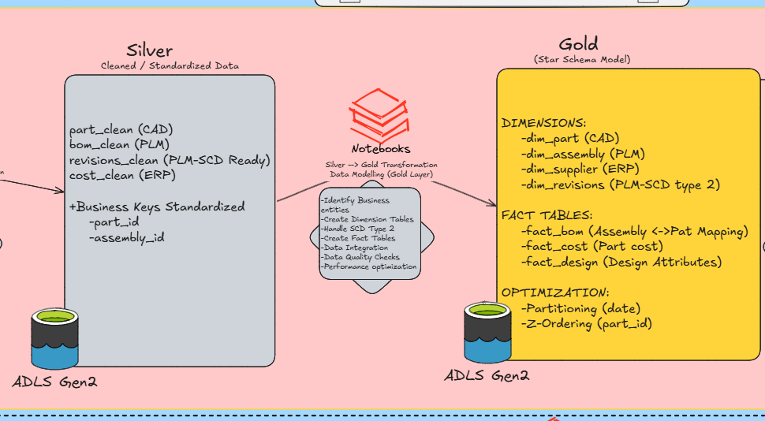
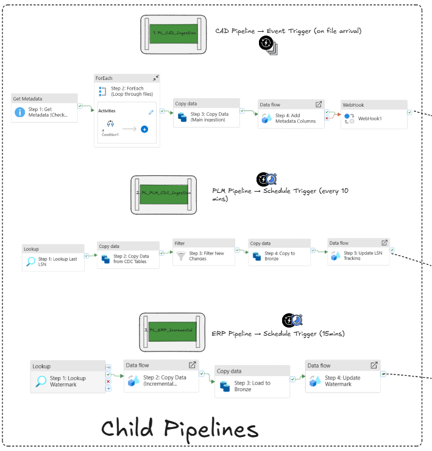
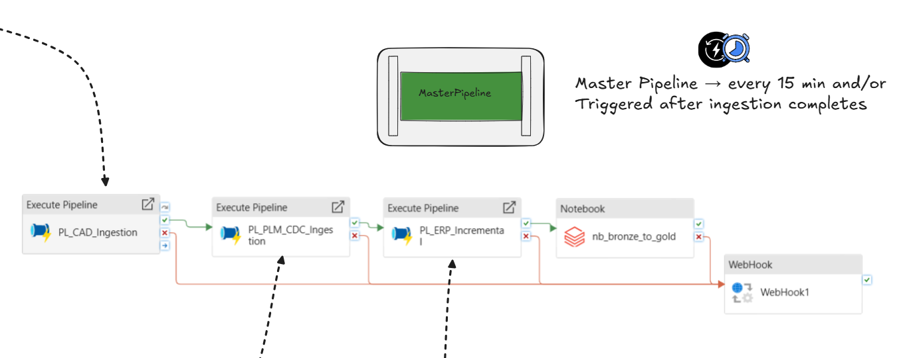

Planning  -->[View the live project blueprint](https://htmlpreview.github.io/?https://raw.githubusercontent.com/Abhi-Gangurde/engineering-data-platform-cad-plm-erp/refs/heads/main/docs/html/Plan-->cad-plm-erp-architecture.html)
Execution -->[View the live project blueprint](https://htmlpreview.github.io/?https://raw.githubusercontent.com/Abhi-Gangurde/engineering-data-platform-cad-plm-erp/refs/heads/main/docs/html/Execution-->engdata-blueprint.html)
# engineering-data-platform-cad-plm-erp
End-to-End Data Engineering Platform using ADF, Databricks, and Delta Lake  integrating CAD, PLM, and ERP systems with CDC, incremental processing, and medallion architecture.

#  Engineering Data Platform (CAD + PLM + ERP)

##  Overview

This project demonstrates a **production-grade end-to-end data engineering platform** that integrates **CAD, PLM, and ERP systems** using modern Azure data services.

The solution is built using:

* **Azure Data Factory (ADF)** for orchestration & ingestion
* **Azure Databricks (PySpark)** for transformation
* **Delta Lake (Medallion Architecture)** for data processing
* **Metadata-driven orchestration** for reliability and scalability

---

##  Business Problem

Engineering and manufacturing organizations generate data across multiple systems:

* **CAD** → Design metadata
* **PLM** → Bill of Materials (BOM), revisions
* **ERP** → Cost, supplier, financial data



👉 These systems are siloed, making it difficult to:

* Analyze product cost
* Track revision impact
* Optimize supplier performance

---

## Solution

This project builds a **unified data platform** that:

* Ingests data from multiple sources
* Standardizes and cleans data
* Builds analytical models (Fact & Dimension tables)
* Serves data to BI tools for insights

---

##  Architecture


###  High-Level Flow

```
CAD (Files) ──► ADF (Event Trigger)
PLM (CDC)  ──► ADF (Schedule Trigger)
ERP (DB)   ──► ADF (Incremental Load)

                    ↓
              Bronze Layer (Raw)

                    ↓
            Databricks Processing

                    ↓
        Silver Layer (Cleaned Data)

                    ↓
         Gold Layer (Star Schema)

                    ↓
        Serving Layer (Aggregations)

                    ↓
             Power BI / Analytics
```

---

##  Tech Stack

| Layer         | Technology                 |
| ------------- | -------------------------- |
| Orchestration | Azure Data Factory         |
| Processing    | Azure Databricks (PySpark) |
| Storage       | ADLS Gen2                  |
| Format        | Delta Lake                 |
| Database      | Azure SQL                  |
| Visualization | Power BI                   |
| Governance    | Metadata Tables            |

---

##  Data Ingestion Strategy




| Source | Method                       | Trigger             |
| ------ | ---------------------------- | ------------------- |
| CAD    | File-based batch (CSV)       | Event Trigger       |
| PLM    | SQL Server CDC               | Schedule (5–15 min) |
| ERP    | Incremental Load (watermark) | Hourly Schedule     |

---

## 🥉🥈🥇 Medallion Architecture

###  Bronze Layer (Raw)

* Stores ingested data as-is
* Adds metadata:

  * ingestion_time
  * source_system
  * batch_id

---

###  Silver Layer (Cleaned)

* Data cleaning & transformation:

  * Null handling
  * Deduplication
  * Schema standardization
* Prepares data for modeling



---

###  Gold Layer (Business Model)

* Star Schema design:

#### Dimensions:

* `dim_part`
* `dim_supplier`
* `dim_revision` (SCD Type 2)

#### Facts:

* `fact_bom`
* `fact_cost`




---

##  Orchestration (ADF Pipelines)

### Pipelines:

* `PL_CAD_Ingestion`
* `PL_PLM_CDC_Ingestion`
* `PL_ERP_Incremental`
* `PL_MASTER_PIPELINE`
* 


---

###  Master Pipeline Logic

* Reads pipeline status from metadata table
* Waits until all pipelines succeed
* Triggers Databricks notebook
* Updates execution status



---

##  Metadata-Driven Design

### Tables:

#### `metadata.pipeline_status`

Tracks pipeline execution

| Column        | Description                |
| ------------- | -------------------------- |
| pipeline_name | Name of pipeline           |
| run_id        | Unique execution ID        |
| status        | RUNNING / SUCCESS / FAILED |
| start_time    | Start timestamp            |
| end_time      | End timestamp              |

---

#### `metadata.watermark_table`

Used for ERP incremental loads

---

#### `metadata.cdc_tracking`

Tracks PLM CDC processing

---

##  Data Quality Framework

Implemented checks:

* Null validation
* Duplicate detection
* Referential integrity
* Business rule validation

Results stored in:

```
metadata.data_quality_log
```

---

##  SCD Type 2 Implementation

Handled in:

```
dim_revision
```

Tracks:

* historical changes
* effective dates
* current flag

---

##  Performance Optimization

* Partitioning (date-based)
* Z-ordering (Databricks)
* Delta Lake optimizations
* Pre-aggregated serving tables

---

##  Serving Layer

Created optimized tables for BI:

* `assembly_cost_summary`
* `part_cost_view`
* `supplier_performance`

---

##  Security

* Row-Level Security (RLS)
* Column masking for sensitive fields
* Role-based access control

---

##  Monitoring & Alerts

* ADF monitoring dashboard
* Retry policies
* Failure alerts (Email/Teams)

---

##  Testing (SDET Advantage )

* Data validation scripts
* Automated checks using PyTest
* Pipeline validation scenarios

---

##  Use Cases

* Cost roll-up analysis
* Revision impact tracking
* Supplier performance insights
* Engineering analytics

---

##  How to Run

1. Deploy ADF pipelines
2. Configure linked services
3. Upload sample data (CAD CSV)
4. Run pipelines or wait for triggers
5. Execute Databricks notebook
6. Query Gold / Serving layer

---

##  Repository Structure

```
├── data/
│   ├── cad/
│   ├── plm/
│   ├── erp/
│
├── pipelines/
│   ├── adf/
│
├── notebooks/
│   ├── bronze_to_gold.py
│
├── sql/
│   ├── metadata_tables.sql
│   ├── gold_schema.sql
│
├── docs/
│   ├── architecture.png
│
└── README.md
```

---

##  Key Highlights

* Multi-source ingestion (CAD + PLM + ERP)
* CDC + Incremental + Event-based pipelines
* Metadata-driven orchestration
* Medallion architecture implementation
* Production-ready design

---

##  Learnings

* Handling multi-source data integration
* Designing scalable pipelines
* Implementing SCD Type 2
* Building metadata-driven workflows

---

##  Author

**Abhishek G**
Data Engineering

---

## ⭐ If you like this project

Give it a ⭐ and feel free to connect!
